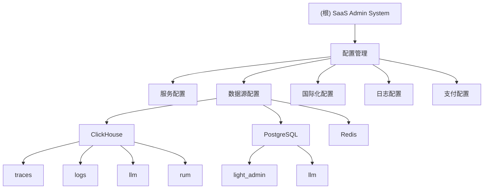

# SaaS Admin System - 项目文档

## 变更记录 (Changelog)

- **2025-11-19**: 初始项目分析和文档创建

## 项目愿景

SaaS Admin System 是一个面向企业级应用的管理系统，专注于多数据源集成、国际化支持和微服务架构。

## 架构总览

### 技术栈
- **数据存储**: ClickHouse (分析型), PostgreSQL (事务型), Redis (缓存)
- **国际化**: 支持中文(zh-CN)和英文(en)
- **支付集成**: Stripe
- **配置管理**: YAML格式集中配置

### 系统组件
- **追踪系统** (traces): 分布式追踪数据
- **日志系统** (logs): 应用日志收集与分析
- **LLM服务** (llm): 大语言模型集成
- **用户体验监控** (rum): 前端性能监控

## 模块结构图

## 模块索引

| 模块 | 路径 | 描述 | 状态 |
|------|------|------|------|
| 配置管理 | doc/config.yaml | 系统全局配置 | ✅ 完整 |
| 数据库文档 | doc/db.md | 数据库结构文档 | ⚠️ 空文件 |

## 运行与开发

### 启动服务
- 服务端口: 8087
- 许可证过期: 24小时

### 环境要求
- ClickHouse: 192.168.2.81:39000
- PostgreSQL: 192.168.2.81:35432
- Redis: 192.168.2.81:36379

## 测试策略

目前项目中未发现测试文件，建议在后续开发中添加：
- 单元测试覆盖核心业务逻辑
- 集成测试验证数据源连接
- API测试确保服务间通信

## 编码规范

由于当前项目主要为配置文件，建议：
- 配置文件使用YAML格式
- 遵循YAML语法规范
- 敏感信息使用环境变量或密钥管理

## AI 使用指引

- 当前为配置型项目，AI可协助：
  - 配置文件语法检查
  - 数据源连接测试
  - 部署脚本编写
  - 文档生成与更新

## 注意事项

1. **缺失源代码**: 当前目录仅包含配置文件，缺少实际业务逻辑代码
2. **安全考虑**: 配置文件包含明文密码，建议使用密钥管理系统
3. **架构推测**: 基于配置文件推断的系统架构，需要实际代码验证